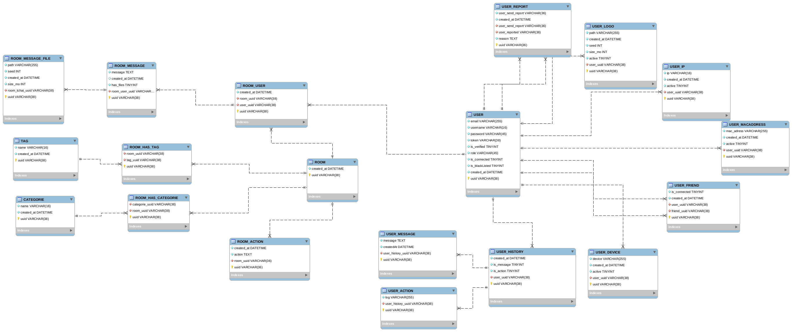

# Base de donnée

## Diagramme de la base de donnée (MySql / MariaDB)

!!! summary "information"
    Ce diagramme montre la structure basique de la base de donnée.

    La base de donnée est composée de plusieurs tables :

    - **`USER`** : Les utilisateurs
    - **`USER_REPORT`** : Les rapports des utilisateurs sur une personne s'étant mal comportée.
    - **`USER_LOGO`** : Les logos des utilisateurs
    - **`USER_IP`** : Les adresses IP des utilisateurs
    - **`USER_MACADDRESS`** : Les adresses MAC des utilisateurs
    - **`USER_FRIEND`** : Les amis des utilisateurs
    - **`USER_DEVICE`** : Les appareils utilisés par les utilisateurs
    - **`USER_HISTORY`** : Les historiques des utilisateurs
    - **`USER_MESSAGE`** : Les messages des utilisateurs
    - **`USER_ACTION`** : Les actions des utilisateurs
    - **`ROOM`** : Les salons
    - **`ROOM_USER`** : Les utilisateurs dans les salons
    - **`ROOM_MESSAGE`** : Les messages dans les salons
    - **`ROOM_ACTION`** : Les actions dans les salons
    - **`ROOM_MESSAGE_FILE`** : Les fichiers dans les salons
    - **`ROOM_HAS_TAG`** : Les tags dans les salons
    - **`ROOM_HAS_CATEGORIE`** : Les catégories dans les salons
    - **`TAG`** : Les tags
    - **`CATEGORIE`** : Les catégories
     
